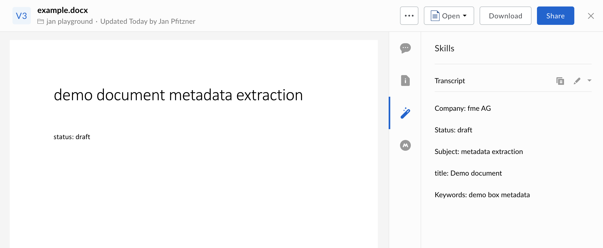

# Box Skill - MS Office metadata extraction

Use the [MS Office document properties extraction library](https://github.com/alfrescian/office-document-properties) to automatically extract metadata from MS Office files and attach them to your files as metadata.




## Usage

### Prerequisites

* Make sure to sign up for a [Box Developer](https://developer.box.com/) account and prepare your app for Box skills. See our [developer documentation](https://developer.box.com/docs/box-skills) for more guidance. 

### Configuring Serverless

Box skills uses the excellent [Serverless framework](https://serverless.com/). This framework allows for deployment to various serverless platforms, but in this example we will use AWS as an example.

To use Serverless, install the NPM module.

```bash
npm install -g serverless
```

Next, follow box guide on [configuring Serverless for AWS](https://github.com/box-community/sample-image-skills/blob/master/AWS_CONFIGURATION.md), or any of the guides on [serverless.com](https://serverless.com/) to allow deploying to your favorite serverless provider.

### Deploying

Clone this repo and change into the Rossum folder.

```bash
git clone https://github.com/fmeAG/box-ms-office-metadata-extraction-skill
cd box-ms-office-metadata-extraction-skill
npm install
```

If you like to leverage custom properties that you're using within your MS Office documents then simply adapt the example [custom-properties.ts](./custom-properties.ts) file to ypur needs, e.g.

```ts
...

export const customPropertiesSettings = [
  {
    name: "yourCustomProperty",
    msName: "YourCustomProperty",
    type: "string"
  }
];

```

Finally, deploy the Skill.

```bash
serverless deploy -v
```

At the end of this, you will have an invocation URL for your Lambda function. 

### Set the invocation URL

The final step is to [configure your Box Skill with the invocation URL](https://developer.box.com/docs/configure-a-box-skill) for your Lambda function. You should have received this in the previous, after you deployed the function for the first time.

Once your new skill is called by our code, the Skill usually takes around a few minutes to process and write the new metadata to the file.